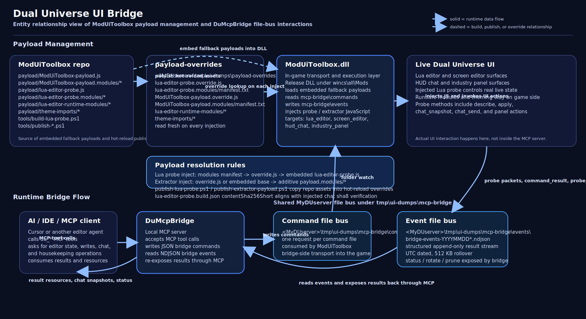

# ModUIToolbox

Embedded myDU DLL mod that injects a defensive JavaScript payload into the DU client UI and stores returned packets on the server as NDJSON dumps.

The repository and DLL use name `ModUIToolbox`, but the in-game mod menu and user-facing action labels are `UI Toolbox`.

High-level architecture overview:



## Start Here

Important local-path note:

- Several scripts and build defaults in this project assume the author's local myDU server path on `D:\MyDUserver`.
- On another PC, this will most likely need adaptation so the paths point to the correct drive and folder of your own MyDuServer installation.
- The most common places are the default `DumpDir` in scripts such as `tools\publish-lua-probe.ps1` and the `DUExternalLibDir` default in `ModUIToolbox.csproj`.

Most important workflow in this project:

- `## Hot-Reload Workflow (Lua Probe)` -> jump to [`Hot-Reload Workflow (Lua Probe)`](#hot-reload-workflow-lua-probe)

This repo now includes:

- robust full CSS extraction (`ALL .css files (full)`)
- full script-body extraction (`ALL .js files (full)`)
- NDJSON reassembly into per-section files
- automatic HTML splitting (`html.html` -> raw `html\*.html` fragments by default)
- all-scripts extraction omits toolbox-injected scripts by default

## Feature Overview

`ModUiToolbox` is the in-game half of the whole bridge workflow. It is not just a dump tool. Its main job is to connect the live Dual Universe UI to local tools such as `DuMcpBridge`, IDE sync, Lua Painter, and other runtime modules.
This bridge (separate folder) as a MCP server is meant for the use of AI assistants!

Main features:

- reads bridge command files from `tmp\ui-dumps\mcp-bridge\commands` and writes structured bridge events back to `tmp\ui-dumps\mcp-bridge\events` (`tmp` being in the myDU server folder)
- injects the Lua probe into the live editor UI so MCP tools can inspect and control the real in-game state
- supports Lua editor and screen editor workflows (for programming boards, flight controllers, screens/signs), including live describe, select, apply, and save sequences through the bridge
- supports file-based IDE sync for `lua_editor` and `screen_editor`
- remembers viewport and caret position for editor contexts so reopening the same context is less disruptive
- keys Lua viewport memory from the live slot/filter manager identity during the active probe session, which is critical when a slot contains duplicate handler names such as multiple `onStart()` or `onTimer(...)` rows
- provides themed editor UI, runtime-module loading, and extra in-game controls such as `IDE Sync`
- can capture full UI dumps, stylesheet dumps, and script dumps when deeper inspection is needed
- exposes an `industry_panel` bridge target for live industry panel inspection/control without leaving the open panel UI
- exposes a separate server-side `toolbox_ops` bridge target for deterministic construct/storage operations such as resolving storages, reading contents, moving slot contents, spawning item types, taking item types, and dropping slot quantities
- supports optional server-side chat snapshot reads for bridge workflows that need more than the visible HUD tab
- rotates bridge-event files by UTC date and rolls over each active file at `512 KB` so one long session does not create one giant event file

## User Manual

Use this mod in one of three common ways.

For normal AI assistant, MCP-driven Lua or screen editor work:

1. Build and deploy `ModUIToolbox.dll` in `Release`.
2. With the myDU server not running, make sure to adapt the following path and copy the dll into that "Mods" folder: "C:\MyDUserver\wincs\all\Mods".
3. Restart the server.
4. Make sure you installed and activated the `DuMcpBridge` MCP server in your AI-capable IDE, like Cursor, OpenCode, VS Code etc.
5. In game, right click any programming board or screen and open the right-click context menu, hover over "Mod: UI Toolbox" and click "Inject LUA editor probe".
6. In top-left corner a kebab menu button appears, hit TAB to go into mouse mode and click on it.
7. By default it shows the published runtime-module toggles; enable `Theming`, the editor enhancements, or any other extras you want.
8. If `Theming` is enabled, the global theme controls appear beside the top-left runtime-module kebab. If editor enhancements are active, opening a programming board or screen editor also shows the editor QoL tweaks on the currently active themed UI.
9. Use the MCP tools from outside the game. `ModUiToolbox` is the part that receives those commands in the game and sends the results back out.

For live IDE sync:

1. Start the sync watcher from `tools\sync-ide.ps1`.
2. In the open in-game editor, click `IDE Sync`.
3. Edit the exported workspace file in your IDE (whichever is registered to .lua file types).
4. Save the file and let the watcher push the change back through the bridge import path.
5. Save in-game explicitly when you want the final change applied.

For UI inspection or reverse engineering (highly experimental!):

1. Use the in-game `UI Toolbox` actions to run a safe or deep dump, stylesheet extraction, script extraction, or probe injection.
2. Reassemble the resulting NDJSON files with `tools\reassemble-ui-dump.ps1`.
3. Inspect the generated HTML, CSS, JS, or bridge-event output locally.

If you only remember one thing, remember this: `ModUiToolbox` is the in-game transport and execution layer.
`DuMcpBridge` talks to it from the outside, but this mod is the piece that actually reaches into the running DU UI.

## In-Game Actions

- `UI Toolbox\Run UI Dump (Safe)`
- `UI Toolbox\Run UI Dump (Deep)`
- `UI Toolbox\Extract Stylesheet\ALL .css files (full)`
- `UI Toolbox\Extract Stylesheet\From target-stylesheet-url.txt`
- `UI Toolbox\Extract Scripts\ALL .js files (full)`
- `UI Toolbox\Inject LUA editor probe` (inside the `mod: UI Toolbox` submenu on element context menus)

## Action IDs

- `1`: safe full dump
- `2`: deep full dump
- `3`: extract all linked `.css` stylesheets
- `4`: extract one stylesheet URL from `tmp/ui-dumps/target-stylesheet-url.txt`
- `5`: inject Lua editor probe (context-menu / Lua editor instrumentation)
- `6`: extract all script bodies (`.js`) from loaded script tags
- `900001`: payload packet ingest (internal)

## Project Files

- `ModUIToolbox.csproj`: C# mod project
- `ModUIToolbox.cs`: mod implementation (`GetName() == NQ.UIToolbox`)
- `payload/ModUiToolbox-payload.js`: embedded extractor payload base script
- `payload/ModUiToolbox-payload.modules/`: additive extractor payload modules loaded after the base script. This is the extension layer for non-editor HUD probes such as the industry panel probe.
- `payload/lua-editor-probe.modules/`: source modules for the Lua probe bundle (manifest-driven). This is one extension layer of the modular plugin-style system: add or change module files here, then build + publish, and the live probe can pick up the new bundle without replacing the mod DLL.
- `payload/lua-editor-probe.js`: composed Lua probe payload (generated from modules)
- `payload/lua-editor-probe.build.json`: fingerprint from `build-lua-probe.ps1` (`contentSha256Short` matches the chat hash); **embedded** in the DLL (LogicalName `lua-editor-probe.build.json`) and mirrored under `lua-editor-probe.modules/` for publishes
- `payload/lua-editor-runtime-modules/`: separately discovered runtime modules shown in the Lua probe kebab menu. This is the second extension layer: add a new module directory with `module.json` + entry script, publish it to `payload-overrides`, and it becomes available live without replacing the mod DLL.
  Some modules, such as `industry-panel`, consume shared persisted state from `theming` instead of keeping a separate parallel settings system.
- `payload/theme-imports/`: optional theme catalog imports that are also published into runtime overrides for live probe usage
- `tools/build-lua-probe.ps1`: compose `lua-editor-probe.modules` into `payload/lua-editor-probe.js` (injects outer IIFE + `"use strict"`; module sources omit the wrapper so IDEs can lint them). **Important:** this does **not** copy anything into `tmp/ui-dumps/payload-overrides`.
- `tools/publish-extractor-payload.ps1`: publish the base extractor payload plus additive extractor modules to `payload-overrides\ModUiToolbox-payload.override.js` and `payload-overrides\ModUiToolbox-payload.modules\`
- `tools/publish-lua-probe.ps1`: compose + publish all live override assets to runtime override paths (default `DumpDir`: `C:\MyDUserver\tmp\ui-dumps`): `lua-editor-probe.override.js`, `lua-editor-probe.build.json`, `lua-editor-probe.modules/`, `lua-editor-runtime-modules/`, and `theme-imports/`. Use this for every live probe test after JS/module changes.
- `tools/reassemble-ui-dump.ps1`: reassemble NDJSON to files
- `tools/split-html-dump.py`: split `html.html` by direct `<body>` root elements into raw fragment files by default

## Build Requirements

- Target framework for the mod is `net6.0` (configured in `Directory.Build.props`). Keep this as-is for game/runtime compatibility.
- SDK selection is pinned via `global.json` to a stable SDK (`8.0.418`, `allowPrerelease=false`) so local/TUI builds do not drift to preview SDKs (`NETSDK1057`).
- External DU runtime assemblies are resolved from `DUExternalLibDir` (default: `C:\MyDUserver\wincs\all`).
- Keep Orleans + Microsoft.Extensions dependencies aligned to the DU runtime DLL graph. Mixing additional NuGet Orleans/Extensions package trees on top can reintroduce `MSB3277` assembly conflict warnings.
- Build from the `ModUiToolbox` folder so `global.json` is respected.
- Build this mod only with `Release`. Do not use `Debug` builds for deployment, live testing, or handoff.
- The optional server-side chat read path is a hard compile opt-in: only builds that pass `-p:EnableDuChatServerRead=true` include the `server_chat` bridge target.

Authoritative workflow note:

- For `ModUiToolbox`, this README is the source of truth for build + deploy + live-test workflow.
- Treat the root [`README.md`](../README.md) only as a reminder that points back here.
- If this file says `Release`, then `Debug` is wrong. No exceptions for live testing or handoff.
- If the live DLL may be locked by the running server, stop and ask the user to handle the restart/unlock step. Do not improvise with alternate filenames, side-by-side deploys, temp folders, or swap tricks unless the user explicitly asks for that exact workflow.

## Build

Mandatory: every `ModUiToolbox` build must use `Release`. If the build output came from `Debug`, do not deploy it, do not use it for live testing, and rebuild immediately in `Release`.

```powershell
cd .\ModUiToolbox
dotnet build -c Release -nologo -v:minimal
```

Optional server-side chat read path:

```powershell
dotnet build -c Release -nologo -v:minimal -p:EnableDuChatServerRead=true
```

With custom runtime DLL directory:

```powershell
dotnet build -c Release -nologo -v:minimal -p:DUExternalLibDir="C:\MyDUserver\wincs\all"
```

## Deploy

Target mod path:

- `C:\MyDUserver\wincs\all\Mods\ModUIToolbox.dll`

Deployment rule:

- Only deploy the `Release` DLL from `bin\Release\net6.0\win-x64\ModUIToolbox.dll`.
- If the server is stopped, copy normally.
- If the server is running or the DLL may be locked, do not try to work around that with `.new`, `.bak`, renamed copies, alternate folders, or any other side path unless the user explicitly asks for that exact approach.
- Default behavior when the live DLL may be in use: ask the user to stop/restart the server, then copy the normal target file.

Normal copy command:

```powershell
Copy-Item `
  '<repo-root>\ModUiToolbox\bin\Release\net6.0\win-x64\ModUIToolbox.dll' `
  'C:\MyDUserver\wincs\all\Mods\ModUIToolbox.dll' -Force
```

For the optional `server_chat` read path, the same deploy/restart rule applies: a successful local build alone is not enough; the running server must load the newly built DLL before the new bridge target is available.

Once the updated DLL is loaded, the bridge emits `server_chat_snapshot` events and the MCP tools `du_chat_server_snapshot` / `du_chat_server_mentions` can read subscribed channels independently of the currently visible HUD tab.
The SQL read path now resolves distinct subscribed channel IDs first so duplicated subscription rows do not duplicate chat messages in the snapshot.

## Output

Default dump directory:

- `C:\MyDUserver\tmp\ui-dumps`

Runtime payload override directory (read fresh on every injection):

- `C:\MyDUserver\tmp\ui-dumps\payload-overrides`
- `ModUiToolbox-payload.override.js`
- `ModUiToolbox-payload.modules\manifest.txt` (optional additive extractor module mode)
- `lua-editor-probe.override.js`
- `lua-editor-probe.build.json` (optional: repo fingerprint from `build-lua-probe.ps1`; compare `contentSha256Short` to the chat suffix hash)
- `lua-editor-probe.modules\manifest.txt` (optional module override mode)

Each run writes:

- `<dumpId>.ndjson`

## Hot-Reload Workflow (Extractor Payload)

Use this when you want to tweak the base UI dump or non-editor HUD probe behavior live without rebuilding the DLL.

Edit one of these for live changes:

- `C:\MyDUserver\tmp\ui-dumps\payload-overrides\ModUiToolbox-payload.override.js`
- `C:\MyDUserver\tmp\ui-dumps\payload-overrides\ModUiToolbox-payload.modules\*.js` (with `manifest.txt`)

Extractor override resolution order on each inject:

1. base extractor script (`ModUiToolbox-payload.override.js` if present, otherwise embedded `payload/ModUiToolbox-payload.js`)
2. additive extractor modules from `payload-overrides\ModUiToolbox-payload.modules\manifest.txt`

The additive module layer runs after the base payload script is loaded but before payload bootstrap dispatch begins. Modules can register extra payload modes through `window.__UI_TOOLBOX_PAYLOAD_API__`.

Current additive module:

- `900-industry-panel-probe.js`
  - provides shared industry panel DOM helpers used by both the visible helper UI and the bridge-driven admin probe
  - can inspect current industry panel state
  - can override the live `Time remaining` label with a finer multi-unit format
  - currently the helper uses `2` precision units (`min` + `s`) and leaves the game's original label untouched when the remaining time drops below `60` seconds
  - can report current production mode plus visible `Make` / `Move` / `Maintain` semantics and whether the open panel is a transfer unit
  - can switch production mode to `Run`, `Make`, `Move`, or `Maintain`
  - can set `Make` / `Move` / `Maintain` values through payload config
  - can show an optional centered `Industry Helper` button while the industry panel is visible
  - consumes the shared global theming state while the panel is visible
  - uses the persisted `industry-panel` runtime-module toggle when `industryPanelKebabEnabled` is not set explicitly
  - uses the persisted `industry-panel` runtime-module `timePrecisionUnits` state when `industryPanelTimePrecisionUnits` is not set explicitly
  - consumes the shared `theming` runtime-module theme selection and theme on/off state rather than keeping industry-only theme preferences
  - can press the live `Start`, `Finish & stop`, and `Stop` buttons
  - treats transfer units as a first-class case; the panel reports whether the open machine is a transfer unit, and `move` is exposed as the semantic alias of the underlying batch mode used by transfer units
- `905-industry-admin-probe.js`
  - handles payload mode `industry_panel_probe`
  - is driven through the `industry_panel` bridge target rather than visible outer mod-menu actions
  - keeps bridge-only industry inspection and control in its own payload module
  - reuses the shared panel helpers exported by `900-industry-panel-probe.js`

Separate from that payload path, `ModUiToolbox` also exposes a pure server-side `toolbox_ops` bridge target.
It does not use the extractor payload and does not extend `905`.
It exists so higher-level agents can compose deterministic construct/storage workflows without mixing that logic into the live industry-panel payload.

`toolbox_ops` now also owns a static construct index under `tmp\ui-dumps\mcp-bridge\state\constructs.sqlite`.
That index stores construct heads plus relational `elements` and `links` tables.
It excludes voxels on purpose and is meant for fast topology and semantic-name lookup, not live runtime truth.

Current `toolbox_ops` methods:

- `refresh_construct_index`
  - refreshes one construct snapshot into the mod-side SQLite index using elements and links only
- `query_construct_index`
  - queries the indexed construct snapshot by exact/static and semantic filters
  - supports category, exact name, name contains, semantic item id/name, semantic item class, industry family, industry tier, and static recipe semantics through `producesItemName` / `consumesItemName`
- `nearby_construct_index`
  - returns indexed elements near one anchor element by stored construct-local position
  - supports exact anchor `id` or exact `name`, 3D radius, optional vertical tolerance, category filters, and optional industry-family filtering
- `related_construct_index`
  - returns a compact related subgraph around one construct-local `id` or exact name
  - supports depth-limited expansion, optional output category filtering, and typed edges such as `industry_output_to_storage`, `storage_to_transfer_input`, `transfer_output_to_storage`, and `hub_child`
- `describe_industry_branch`
  - packages nearby branch topology around one anchor into recognized branch kinds such as `direct_producer_bank_to_storage`, `support_refill_tu_to_storage`, and `storage_to_distribution_tu_bank`
- `trace_construct_index`
  - walks upstream or downstream from one anchor with bounded hops and optional stop conditions such as `stopAtItemClass` or `stopAtIndustryFamily`
- `describe_bank_from_anchor`
  - expands one machine or storage anchor into repeated same-role banks
  - supports grouping by `shared_output_storage`, `shared_input_support_pattern`, or `none`
- `describe_consumer_bank_branches`
  - summarizes a multi-input consumer bank plus grouped upstream input branches by item and storage anchor
- `describe_industry_supports`
  - returns industry support storage branches directly from the mod-owned construct index
  - fills the workflow gap that `query_construct_index` and `related_construct_index` did not package in one deterministic call
  - reports the support storage, the actual refill target, downstream industry consumers, upstream feeder transfer units, feeder source storages, and compact feeder runtime
  - accepts an optional downstream `industryFamily` filter such as `smelter` or `refiner`
  - keeps support-feeder traversal in `toolbox_ops` instead of requiring external SQLite reads
- `describe_industry_support_storage`
  - builds on `describe_industry_supports` for storage-focused workflows
  - returns the same support branch structure plus live snapshots for the support buffers and optional feeder source storages
  - keeps “support topology plus actual storage contents” in one deterministic backend call instead of many external storage reads
- `resolve_storage`
  - resolves one target deterministically from explicit selectors
  - supports `player_inventory`, `player_inventory_raw`, `player_primary_container`, `container`, and `container_hub`
  - for construct-backed storage, accepts exactly one of construct-local `id` or exact `name`
  - `constructId` is optional; when omitted, the player's current construct is used as the default search scope
  - ambiguous matches return a structured candidate list instead of picking one
- `describe_storage`
  - reads one resolved storage and returns occupied slots plus capacity state
  - when passed an `entries` batch, it returns one compact per-storage result list in the same method instead of requiring a second batch-specific storage describe primitive
- `spawn_item`
  - gives an item type into the chosen storage target by exact item name or item type id
- `take_item`
  - removes an item type from the chosen storage target by exact item name or item type id
- `move_slot`
  - moves part or all of one occupied source slot into another resolved storage target
- `drop_slot`
  - removes part or all of one occupied source slot without moving it elsewhere
- `construct_runtime_availability`
  - reports the player's current construct, the target construct, and whether live industry/storage reads are expected to work from the current position
- `resolve_industry_recipe`
  - resolves one recipe deterministically for one target industry element from either an explicit recipe id or an exact product item selector
  - for transfer units, the resolved recipe id is the product item type id
- `industry_stop`
  - stops one industry unit directly through the server-side grain path
  - supports `soft` and `hard`
- `industry_set_recipe`
  - sets one recipe directly on one stopped industry unit through the server-side grain path
- `industry_start`
  - starts one industry unit directly through the server-side grain path
  - supports `run`, `make`, `move`, and `maintain`
  - `move` is the transfer-unit alias

Practical `toolbox_ops` workflow:

1. Refresh the construct index when topology may be stale.
   - Use `refresh_construct_index` once per construct before heavy topology work.

2. Find one exact anchor first.
   - Use `query_construct_index` for exact names, semantic item classes, industry-family filters, or recipe-capability lookups such as `producesItemName`.
   - Use `nearby_construct_index` when the workflow starts from one known local element and needs the surrounding bank.
   - Use `related_construct_index` when you already know one element and want its compact linked subgraph.

3. Switch to a packaged branch query when the workflow is really about one branch type.
   - Use `describe_industry_branch` when the anchor may be a direct producer branch, a refill-TU branch, or a distribution-TU branch and the caller needs the returned `branchKind`.
   - Use `trace_construct_index` when the workflow needs a bounded upstream/downstream walk with clear stop conditions.
   - Use `describe_bank_from_anchor` when one machine or output storage should expand into a repeated bank.
   - Use `describe_consumer_bank_branches` when the real question is “which grouped upstream inputs feed this consumer bank?”
   - Use `describe_industry_supports` for support-buffer topology: support storage, refill target, downstream consumers, feeder TUs, and feeder source storages.
   - Use `describe_industry_support_storage` when you need the same branch plus live storage snapshots for the support buffers and feeder sources.

4. Use live backend reads only for current runtime and current stock.
   - Use `construct_runtime_availability` first when the caller is not sure whether live reads can work from the player's current position.
   - Use `describe_storage` for current storage contents.
   - `describe_storage` is batchable by default through `entries`, so one call can read many storages.
   - Use the industry runtime methods when the workflow needs current recipe, mode, or maintain quantities instead of static topology.

5. Mutate in batches, then confirm in batches.
   - Resolve the branch from one anchor first.
   - Then apply storage and industry writes to the derived targets instead of hopping around manually in the UI.

Typical patterns:

- Rebuild one support branch from a known support container:
  1. `describe_industry_supports`
  2. `describe_industry_support_storage`
  3. read the returned feeder TUs and source storages
  4. configure the feeder TUs through the industry methods

- Configure a local feeder wall from one known TU:
  1. `nearby_construct_index`
  2. filter the returned bank by exact names, category, or industry family
  3. read current runtime and stock only for the narrowed set
  4. apply one batch mutation pass

- Find producers by product instead of guessed names:
  1. `query_construct_index` with `producesItemName`
  2. `describe_industry_branch` or `describe_bank_from_anchor` from one returned anchor

- Check whether live reads should work before trying runtime calls:
  1. `construct_runtime_availability`
  2. if `liveIndustryReadsExpected = false`, stay on static construct-index queries until the player is at the target construct

- Check many buffers at once:
  1. `describe_storage` with `entries`
  2. inspect `summary` and per-entry `results`

Behavior rules for `toolbox_ops`:

- resolution is deterministic only; no fuzzy matching and no silent fallback target selection
- item names are exact-name matches only; ambiguous names return candidate lists
- construct index queries are static and semantic only; they answer intended topology and naming questions, not live industry runtime
- if a workflow needs packaged topology that static query plus related-subgraph calls do not express cleanly, add a new mod-owned `toolbox_ops` query instead of reading the construct index database externally
- the construct index stores construct-local `id` for user-facing selection and only keeps backend element ids internally for persistence
- the construct index now also stores element positions so vicinity workflows can stay mod-owned and deterministic instead of relying on screenshot grouping or external DB reads
- semantic item matching is intended to support workflow queries such as ore containers, refiner banks, and related TU/industry branches after a naming pass
- recipe-semantic matching in `query_construct_index` is capability-based: `producesItemName` / `consumesItemName` resolve machine types that can run those recipes even when the machine custom names do not mention the product
- industry runtime payloads now include display quantities for the active product as `maintainQuantity` and `currentQuantity`, plus `productItemTypeId` and `productItemName`, so callers do not have to reinterpret raw backend amounts
- quantities are accepted as normal gameplay quantities; material quantities are converted through the gameplay bank before the storage operation runs
- cross-construct work is supported whenever the caller provides explicit construct or storage selectors
- for higher-level user requests, a bare mentioned `ID` should default to the construct-local `id`
- in user-facing commands, do not expose global backend element ids; resolve construct-local `id` to the backend id internally
- for higher-level industry work, resolve the branch first from one named or numbered anchor and only then apply recipe and mode writes to the derived units

Supported `industry_panel_probe` payload config keys:

- `industryPanelInstallTimeOverride: true`
- `industryPanelTimePrecisionUnits: 1 | 2`
  - `1` restores the game's original time label behavior
  - `2` installs the current helper format (`min` + `s` while at least `60` seconds remain)
- `industryPanelButtonAction: "start" | "finish_stop" | "stop"`
- `industryPanelModeAction: "run" | "make" | "move" | "maintain"`
  - `move` is the transfer-unit alias for the same underlying game mode as `make`
- `industryPanelMakeAmount: <int>`
  - also used for transfer-unit `move` amounts
- `industryPanelMaintainAmount: <int>`
- `industryPanelKebabEnabled: true | false`
  - when omitted, the persisted `industry-panel` runtime-module toggle is used
- `industryPanelCssText: "<css>"`
- `industryPanelCssStyleId: "ui-toolbox-industry-panel-style"`
- `industryPanelHtml: "<html>"`
- `industryPanelHtmlTargetSelector: "#industryPanel_productionSubPanel_wrapper"`
- `industryPanelHtmlApplyMode: "replace_inner" | "replace_outer"`

Current HTML/CSS transport behavior:

- CSS is applied through a managed `<style>` tag and can be updated by reinjecting new `industryPanelCssText`.
- HTML is applied to a selected target node, then the module rebinds production subpanel node references and button handlers.
- Existing `Make` / `Move` / `Maintain` number input components are preserved and reattached after HTML replacement.
- After HTML apply, the module refreshes recipe, container, status, mode, and time display state against the live `industryPanel` object.

Runtime-module relationship:

- The runtime module `industry-panel` is the user-facing toggle in the Lua probe `Runtime Modules` menu.
- When enabled and the industry panel is visible, it shows a centered `Industry Helper` button at the top of the UI.
- That helper opens quick controls for:
  - `2-unit time display`
  - `Run`, `Make` or `Move`, `Maintain`
  - `Start`, `Finish & stop`, `Stop`
- While the helper is enabled, the industry panel consumes the same shared theme state as the Lua editor, screen editor, and other themed surfaces.
- The visible theme controls are global rather than industry-local:
  - they sit directly right of the runtime-module kebab
  - they provide shortcut dots for `daisy-black`, `daisy-emerald`, and `daisy-smooth`
  - `...` opens the full Daisy theme catalog
  - `Off` disables theming without losing the last selected theme
- The runtime module persists both:
  - whether the helper is enabled at all
  - the last chosen `timePrecisionUnits` value
- Theme selection and theme enabled/disabled state are owned by the `theming` runtime module, so Lua editor, screen editor, industry panel, and inventory surfaces stay aligned.
- The extractor-side `industry_panel_probe` lives in `905-industry-admin-probe.js` and consumes that persisted state so bridge-driven panel control and the visible helper stay in sync.
- Shared industry panel DOM/time/theme helpers stay in `900-industry-panel-probe.js`, separate from the admin bridge entrypoint.
- The feature is intentionally scoped to the industry panel UI. It does not add outer mod-menu actions.

Transfer-unit note:

- transfer units are special enough to treat explicitly in higher-level workflows
- they exist as one shared element type with many concrete instances on a construct
- for construct-side discovery, use that deterministic transfer-unit type/category as the anchor instead of trying to infer the type from free text
- once the candidate set is restricted to transfer units, instance selection can still use explicit ids, links, or intentional player-assigned names
- `ConstructInspectorBridge` already classifies them via `definition.Is<NQutils.Def.TransferUnit>()` and exposes category `transfer`
- for live industry-panel control, the panel state exposes whether the open machine is a transfer unit and reports the active semantic mode as `move` instead of `make`

Useful sync command:

```powershell
.\tools\publish-extractor-payload.ps1
```

## Hot-Reload Workflow (Lua Probe)

Use this when you want to tweak Lua editor UI behavior live without rebuilding the DLL.

**THIS OFTEN GETS FORGOTTEN: AFTER *EVERY* PAYLOAD CHANGE, ALWAYS RUN THE publish script for the payload you changed, THEN REINJECT IN-GAME.**

Edit one of these for live changes:

- `C:\MyDUserver\tmp\ui-dumps\payload-overrides\lua-editor-probe.override.js`
- `C:\MyDUserver\tmp\ui-dumps\payload-overrides\lua-editor-probe.modules\*.js` (with `manifest.txt`)

Probe override resolution order on each inject:

1. `payload-overrides\lua-editor-probe.modules\manifest.txt` + listed module files
2. `payload-overrides\lua-editor-probe.override.js`
3. embedded `payload/lua-editor-probe.js` in DLL

**Inject confirmation chat:** after a successful Lua probe inject, the chat line ends with **`[probe <injectUtc> <sha8>]`** where **`sha8`** is the first 8 hex chars of **SHA-256 (UTF-8)** over the **exact probe script body** loaded for that inject (concatenated modules, bundle override, or embedded payload). That matches **`contentSha256Short`** in `lua-editor-probe.build.json` after `build-lua-probe.ps1`. **`injectUtc`** is the server inject time (`yyyyMMdd-HHmmss`), not the PS1 stamp.

### Probe composition (IIFE wrapper)

- **Module files** (`*.js` in `payload/lua-editor-probe.modules/`) do **not** contain the outer `(function () { … })();` — they must parse as normal scripts (no top-level `return`).
- **`build-lua-probe.ps1`** wraps the concatenated manifest body with the same preamble/postamble as **`ModUIToolbox.ResolveRuntimeModuleScript`** (`WrappedModuleScriptPreamble` / `WrappedModuleScriptPostamble` in `ModUIToolbox.cs`). If you change one, keep the other in sync.
- Without that wrapper, runtime **module override** mode would inject invalid JS (illegal top-level `return`).

### Global theming controls & themed surfaces

- The runtime module `theming` owns the visible theme controls.
- When `theming` is enabled, the controls appear directly right of the runtime-module kebab in the top-left HUD and are wrapped in a dimmed shared background for readability.
- **Three shortcut dots** switch to **daisy-black**, **daisy-emerald**, and **daisy-smooth**. If no user theme preference exists yet, the default shortcut theme is `daisy-black`.
- **`...`** opens the full Daisy theme catalog.
- **`Off`** disables theming without clearing the last selected theme, so users can quickly switch the shared themed styling on and off.
- Disabling the `theming` runtime module hides those controls and also forces shared theming off.
- Those controls drive shared `--lua-probe-*` CSS variables on the currently active themed UI; see `000-core.js` (`colorThemes`), `023-theme-core.js` (`applyTheme` and theme derivation), `024-theme-ui.js` (theme switcher/catalog UI), and `010-context-and-viewport.js` (injected overrides).
- **`lua_theme_changed`** packets include `theme`, `label`, `accent`, `header`, `caretBg`, `surfaceMain` (and related vars are applied inline on the editor root).
- **APPLY / CANCEL** use theme-specific gradients and 3D shadows (`btnApply*`, `btnCancel*` tokens per preset) so they stay distinct from vanilla DU chrome while matching the active theme.
- The visible `screen_editor` reuses the same shared theme token set as the Lua editor, so both editor UIs stay visually aligned without moving any UI logic into the MCP server.
- The `screen_editor` content header panel (`sub_title`, wrap/font controls, mode switch block) is now themed as well, so the whole top control area matches the active probe theme instead of keeping the vanilla DU look.
- The industry panel and inventory views consume the same shared theme state when their relevant runtime/module paths are active, so the visible surfaces stay consistent.
- The recipe-bank inventory view inside the industry panel now consumes the same shared tokens for its shell, header, toolbars, item grid, footer, and filter flyout instead of keeping the vanilla DU chrome in those sections.
- Shared runtime theme objects now expose `isLight`, and imported Daisy palettes carry compact `il` metadata, so light-theme contrast fixes can stay in the shared theme layer instead of relying on one-off selector guesses.
- For visible spacing between the shortcut dots, `...`, and `Off`, prefer explicit margins on the controls instead of relying on flex `gap`; the embedded DU browser may not render `gap` changes reliably on that global switcher row.
- For live HUD and inventory probe CSS, do not rely on `:is(...)` selector support. The embedded DU browser used on the live HUD path does not support `:is(...)`, so root-scoped theme rules must use explicit selectors or duplicated blocks instead.
- The visible `screen_editor` now also gets its own `IDE Sync` button in the top control row; it uses the same chunked packet family as the Lua editor, but exports with `targetKind = screen_editor`.

#### Repeatable workflow for theme contrast fixes

Use this order when a themed UI surface looks washed out, low-contrast, or otherwise hard to read.

1. Check whether the problem is in the shared theme layer or only in one surface.
2. If multiple surfaces are wrong in the same theme, start in the shared theme layer before touching per-surface CSS.
3. If only one surface is wrong, verify first that the shared theme tokens are already reasonable, then add a scoped override for that surface.

Files to inspect first:

- `payload/lua-editor-probe.modules/000-core.js`
  Holds the built-in fallback themes in `colorThemes`. Use this when the issue only affects the hardcoded built-in themes such as `monokai`, `github-dark`, or `gruvbox-dark`.
- `payload/theme-imports/flowery-daisy-palettes.compact.json`
  Holds imported Daisy palette values plus compact `il` metadata for whether a theme is light.
- `tools/extract-flowery-daisy-palettes.ps1`
  Regenerates the compact Daisy palette import and computes `il` from `DaisyBase100Color`. If imported palettes are misclassified as light/dark, fix the extraction path or source metadata here.
- `payload/lua-editor-probe.modules/023-theme-core.js`
  This is the main shared theme translation layer. Inspect `resolveThemeLightFlag`, `normalizeThemeDefinition`, `buildThemeFromCompact`, and `applyTheme`.
- `payload/lua-editor-probe.modules/024-theme-ui.js`
  This holds the shared theme switcher and catalog UI that drives the shared runtime theme state.
- `payload/lua-editor-runtime-modules/theming/module.js`
  This owns the global theme-control host beside the runtime-module kebab and the enable/disable lifecycle for visible theming controls.
- `payload/lua-editor-probe.modules/010-context-and-viewport.js`
  This is where surface-specific CSS consumes the shared `--lua-probe-*` tokens. Only use this after confirming the runtime theme object is already producing sensible colors.

Methodology:

- First verify the light/dark classification.
  If the wrong surfaces become unreadable only on light Daisy themes, inspect `isLight` / `il` first. A wrong light/dark flag causes many downstream contrast mistakes.
- Then verify the shared token derivation.
  In `023-theme-core.js`, prefer fixing `textMuted`, `textDim`, `cmText`, `cmString`, accent readability, or derived surface colors so the correction benefits every UI that shares the theme object.
- Prefer shared readable tokens over hardcoded colors.
  When possible, use existing variables such as `var(--lua-probe-cm-text)`, `var(--lua-probe-cm-string)`, `var(--lua-probe-text-muted)`, `var(--lua-probe-text-dim)`, and `var(--lua-probe-accent-solid)` rather than new literal hex values.
- Use surface-local overrides only for proven one-off readability problems.
  If a specific control, icon, or decorative asset still looks wrong after the shared token layer is correct, add a scoped selector in `010-context-and-viewport.js` for that surface only.
- For light-theme-only fixes, branch on `data-lua-probe-theme-light="1"` rather than duplicating entire theme blocks.
  That keeps the fix small and avoids changing dark themes unnecessarily.
- Do not guess selectors when a live UI dump is available.
  Use the local extracted HTML and stylesheet dumps as the source of truth for wrapper hierarchy and actual class names before writing overrides.
- For switcher spacing in DU’s embedded browser, prefer explicit margins over flex `gap`.
  The browser may not render `gap` changes reliably on the global theme-switcher row.

Success criteria:

- The fix should improve readability without changing unrelated themes.
- Shared-theme fixes should help Lua editor, screen editor, and industry panel together when they use the same tokens.
- Surface-local fixes should stay scoped and should not replace the shared theme system with a parallel one.

After each edit:

1. Save changed module or `lua-editor-probe.override.js`.
2. In-game, open element context menu.
3. Click `UI Toolbox\Inject LUA editor probe`.
4. Re-open or refocus Lua editor (`Edit Lua script (Ctrl + L)`).
5. Confirm probe is active (probe-owned controls like the runtime-module kebab, the global theme controls, or `IDE Sync` are visible).

No DLL rebuild needed for:

- JS/CSS behavior changes inside `lua-editor-probe.override.js`
- JS changes in module mode (`lua-editor-probe.modules`)
- probe button sizes, colors, toggles, line-highlight styling

DLL rebuild required for:

- `ModUIToolbox.cs` changes (including **Lua probe module concat** / `ResolveRuntimeModuleScript` IIFE wrapper)
- action/menu wiring changes
- payload loader/ingest C# logic changes

Useful sync commands:

```powershell
# Compose modules -> payload/lua-editor-probe.js only
# Does NOT update D:\MyDUserver\tmp\ui-dumps\payload-overrides
.\tools\build-lua-probe.ps1

# Compose + publish single-file + modules to runtime override directory
# Required before an in-game reinject if you changed probe JS/modules
.\tools\publish-lua-probe.ps1

# Publish the base extractor payload + additive extractor modules
.\tools\publish-extractor-payload.ps1

# Source base mod payload -> live override
Copy-Item `
  '<repo-root>\ModUiToolbox\payload\ModUiToolbox-payload.js' `
  'D:\MyDUserver\tmp\ui-dumps\payload-overrides\ModUiToolbox-payload.override.js' -Force

# Source extractor payload modules -> live module override dir
Copy-Item `
  '<repo-root>\ModUiToolbox\payload\ModUiToolbox-payload.modules\*' `
  'D:\MyDUserver\tmp\ui-dumps\payload-overrides\ModUiToolbox-payload.modules' -Force

# Source payload -> live override
Copy-Item `
  '<repo-root>\ModUiToolbox\payload\lua-editor-probe.js' `
  'D:\MyDUserver\tmp\ui-dumps\payload-overrides\lua-editor-probe.override.js' -Force
Copy-Item `
  '<repo-root>\ModUiToolbox\payload\lua-editor-probe.build.json' `
  'D:\MyDUserver\tmp\ui-dumps\payload-overrides\lua-editor-probe.build.json' -Force

# Source module payloads -> live module override dir
Copy-Item `
  '<repo-root>\ModUiToolbox\payload\lua-editor-probe.modules\*' `
  'D:\MyDUserver\tmp\ui-dumps\payload-overrides\lua-editor-probe.modules' -Force

# Live base mod override -> source payload (persist your live tweaks in repo)
Copy-Item `
  'D:\MyDUserver\tmp\ui-dumps\payload-overrides\ModUiToolbox-payload.override.js' `
  '<repo-root>\ModUiToolbox\payload\ModUiToolbox-payload.js' -Force

# Live extractor module override -> source modules
Copy-Item `
  'D:\MyDUserver\tmp\ui-dumps\payload-overrides\ModUiToolbox-payload.modules\*' `
  '<repo-root>\ModUiToolbox\payload\ModUiToolbox-payload.modules' -Force

# Live override -> source payload (persist your live tweaks in repo)
Copy-Item `
  'D:\MyDUserver\tmp\ui-dumps\payload-overrides\lua-editor-probe.override.js' `
  '<repo-root>\ModUiToolbox\payload\lua-editor-probe.js' -Force
```

## Lua Editor Stabilization Runbook (Reproducible)

This is the exact sequence that reproduces the currently working behavior.

### 1) Prepare the active probe override

Recommended (module-first) prep before testing:

**DO NOT STOP AFTER `build-lua-probe.ps1`.** `build` only updates the repo bundle. The live injection path reads from `C:\MyDUserver\tmp\ui-dumps\payload-overrides`. **FOR EVERY LIVE TEST AFTER PAYLOAD CHANGES, ALWAYS BUILD + PUBLISH + REINJECT.**

```powershell
.\tools\publish-lua-probe.ps1
```

### Flowery Daisy Palettes

The Flowery Daisy `axaml` palettes can be exported into a compact DU import format:

```powershell
.\tools\extract-flowery-daisy-palettes.ps1
```

This produces:

- `payload/theme-imports/flowery-daisy-palettes.compact.json`

The compact format stores only the relevant Daisy source colors. For the current DU probe theme, these DU slots are effectively enough as input:

- `p`, `pf`, `pc`
- `nu`, `nc`
- `b1`, `b2`, `b3`, `bc`
- `i`, `w`, `e`

The rest of the current probe theme structure, such as `surfaceRow`, `textDim`, button gradients, or hover colors, can then be derived from that deterministically. That means we do not have to maintain 30+ themes manually as fully expanded DU objects.

The theme catalog can be loaded at runtime. That is why publish also copies `payload/theme-imports/*` to:

- `C:\MyDUserver\tmp\ui-dumps\payload-overrides\theme-imports`

The probe state provides `ensureThemeCatalogLoaded(...)` and `receiveThemeCatalog(...)` for this internally. In the local rig, the same catalog is returned through `/api/mod-action`; in the live mod, the server responds to `theme_catalog_request` with a small JS injection into the open probe.

### 2) Verify with NDJSON packets

Inspect newest `lua-probe-*.ndjson` and confirm:

1. `lua_slot_auto_open`:
   - starts with `status="armed"`,
   - may emit transient `waiting-target-slot` / `waiting-slot-switch`,
   - reaches `status="clicked"` within wait budget.
2. `lua_snippet_switch_begin`:
   - includes `targetSnippetKey`,
   - on revisits shows `targetHasRememberedTopLine=true`.
3. `lua_cm_settle_signal`:
   - includes `kind="target-snippet"` before final switch settle.
4. `lua_snippet_switch_end` / `lua_snippet_switch_settled`:
   - include `settleReason` (normally `quiet-window`),
   - `after.cursor.line` and `afterViewport.topLine` match remembered area.

### 3) Wait budgets and limits (current defaults)

- slot auto-open max lifetime: `5000ms` (`expiresAt`)
- CodeMirror settle max wait: `5000ms`
- settle quiet window: `250ms`
- settle polling tick: `40ms`

No wait path is unbounded.

### 4) Why this works

The successful combination is:

1. stable slot key (`id/data/index`) instead of class-based identity,
2. slot-convergence guard before auto-open click,
3. CodeMirror settle gate (event-driven, not blind delay),
4. target-snippet presence gate before restore,
5. per-snippet memory key restore (`snippet:<len>:<hash>`) plus context fallback,
6. bounded wait windows to prevent lockups.

## IDE 2-Way Sync (Lua + Screen Editor)

The Lua probe supports exporting the current script to a local file, automatically opening it in your IDE (e.g. Cursor), and syncing changes back into the game in real-time.
This now works for both `lua_editor` and `screen_editor`.

Important:

- `sync-ide.ps1` is not optional glue. It is the watcher that reassembles live `IDE Sync` export packets into the player-scoped workspace files.
- Start it once per live work session before using the in-game `IDE Sync` button.
- If the watcher is not running, the in-game button can still emit a valid `lua_ide_sync` packet, but `ide-workspace\player-<playerId>\...\snippet.*` will not update.
- In that state, the export click was real, but the workspace remains stale.

1. Inject the Lua probe in-game.
2. Run the sync script in PowerShell:

   ```powershell
   .\tools\sync-ide.ps1 -DumpDir "C:\MyDUserver\tmp\ui-dumps" -IdePath "cursor"
   ```

3. In the game's open editor, click the `IDE Sync` button in the header.
4. The script will be chunked, written to the server's dump directory, reassembled into the matching player-scoped workspace file, and opened in your IDE:

   - `tmp\ui-dumps\ide-workspace\player-<playerId>\lua_editor\snippet.lua`
   - `tmp\ui-dumps\ide-workspace\player-<playerId>\screen_editor\snippet.txt`

5. Edit the exported workspace file in your IDE and save.
6. The sync script watches for file changes and writes them to the matching player-scoped semaphore file:

   - `ide_import.player-<playerId>.lua_editor.json`
   - `ide_import.player-<playerId>.screen_editor.json`

7. The C# mod detects the semaphore, injects an IDE import request into the probe, and only treats that request as done after an explicit `ide_import_result` ack from the live editor.

Quick reality check after export:

- verify that `snippet.lua` or `snippet.txt` got a fresh timestamp
- verify that `snippet.json` also got a fresh timestamp
- verify that `snippet.json` matches the intended slot/filter context

If those timestamps did not move, the usual cause is that `sync-ide.ps1` was not running when `IDE Sync` was clicked.

MCP transfer contract note:

- MCP-driven editor writes use this same file-based path.
- `du_editor_push_code` now stages `ide_import.player-<playerId>.<targetKind>.json` from a local `sourcePath`.
- Inline bridge/probe `set_code` write paths are intentionally disabled for editor content.
- Reusable live board Lua snapshots belong on a tracked repo path such as `live_lua_coding/`, not in untracked or temporary folders.

Lua-editor safety note:

- If no Lua filter is actively selected, the Lua-side file transfer path is now blocked intentionally.
- In that state the `IDE Sync` button refuses export, and IDE-import apply also refuses to write.
- The intended sequence is: verify current slot + active filter first, then transfer code.

Atomicity / target-isolation notes:

- Export now writes a sidecar file `tmp\ui-dumps\ide-workspace\player-<playerId>\<targetKind>\snippet.json` alongside the workspace code file.
- `snippet.json` is intentionally minimal and contains only `context`, `syncId`, and `updatedAtUtc`.
- Reassembly writes both the workspace code file and the sidecar atomically through temp-file swap, so external editors do not see partial chunk states.
- IDE imports now carry `requestId`, `targetKind`, `contextKey`, `reference`, `baseCodeHash32`, and `baseCodeSha256`.
- The live probe matches imports against the currently open editor before applying. For the Lua editor the current practical anchor is `constructId + slotElementName`, with `editorTitle` as an additional guard.
- For `screen_editor`, the practical anchor is currently `title + subTitle + mode`; the bridge-side fallback reader now also reads the same player-scoped workspace/import files instead of depending only on `screen_state`.
- If the player switched to the wrong board or wrong filter, the probe returns a retryable `ide_import_result` and the mod keeps retrying the same request until the correct target is live again.
- Base hash/version mismatch is no longer blind, but also not a hard stop: the probe reports `applied_stale_base` when it had to write over a changed live base on the same target.
- If `snippet.lua|snippet.txt` and `snippet.json` do not both exist, treat the workspace snippet as invalid and re-export before using it.

Mode note:

- Default behavior is live-tail mode: existing NDJSON content is ignored on startup, and only new packets are processed.
- Use `-ReplayFromStart` only for replay/backfill scenarios (for example tests that pre-seed NDJSON before watcher startup).

Common operator mistake:

- starting the bridge and the probe, but forgetting to start `sync-ide.ps1`
- then clicking `IDE Sync` and assuming the button failed because the workspace files did not change

What actually happened in that case:

- the editor emitted the export packet
- the watcher that should reassemble it into `ide-workspace\...` was missing
- the old workspace snapshot stayed on disk and caused misleading follow-up reads

## DuMcpBridge integration (MCP file bus)

`DuMcpBridge` drops JSON commands under `tmp\ui-dumps\mcp-bridge\commands\`. This mod watches that folder, runs the command in the player HUD client, and appends structured lines to UTC-dated bridge-event files under `tmp\ui-dumps\mcp-bridge\events\`.

Bridge-event file behavior:

- active files are now named `bridge-events-YYYYMMDD.ndjson`
- when one UTC-day file reaches `512 KB`, the mod rolls over to `bridge-events-YYYYMMDD-001.ndjson`, then `-002`, and so on
- old reset/rotation targets are expected to move into `tmp\ui-dumps\mcp-bridge\events\archive\`
- this keeps normal MCP reads bounded and avoids one giant long-lived `bridge-events.ndjson`

Housekeeping ownership:

- `ModUiToolbox` only resolves the correct active dated file for append
- `DuMcpBridge` owns status reporting, rotate/reset actions, and prune operations through MCP tools
- the bridge can prune old event files and old `state\processed-commands\` files after a dry run

Current MCP maintenance tools on the bridge side:

- `du_bridge_events_status`
- `du_bridge_events_housekeeping`

For `action: "probe_call"`, the Lua runtime probe (`payload/lua-editor-probe.modules/035-lua-mcp-runtime.js`, loaded via the usual Lua probe injection) now handles the Lua editor, the screen content editor, and the HUD chat target. The mod maps `lua_mcp_result` packets to bridge events:

- `command_result` — dispatch / injection acknowledgement
- `probe_result` — `method`, `success`, `result`, `error`
- `chat_snapshot` — HUD chat snapshot (`commandId`, `snapshot`)
- `chat_send_result` — channel-bound send result (`commandId`, `success`, `result`, `error`)
- `chat_channel_result` — custom channel create/join result (`commandId`, `success`, `result`, `error`)

Chat timestamp note:

- if chat messages include a `date` field from the in-game chat model, that timestamp is emitted in UTC

Supported probe methods:

- `lua_editor`: `describe`, `list_filters`, `select_slot`, `select_context`, `select_filter`, `select_filter_index`, `apply`, `add_filter`, `outer_html`, `raw_eval`
- `screen_editor`: `describe`, `apply`, `cancel`, `outer_html`, `raw_eval`
- `hud_chat`: `chat_snapshot`, `chat_send`, `chat_join_channel`, `chat_select_channel`

For `lua_mcp_result`, the probe now emits `targetKind` so bridge events can keep `lua_editor`, `screen_editor`, and `hud_chat` separated. MCP entry points: `DuMcpBridge/README.md` (`du_ui_describe`, `du_ui_invoke`, `du_ui_wait`, `du_open_editor_native`, `du_chat_snapshot`, `du_chat_ai_mentions`, `du_chat_send_message`, `du_chat_create_channel`, `du_chat_select_channel`). Chat remains probe-backed internally, but the public MCP chat path is the dedicated `du_chat_*` tool family rather than `du_ui_invoke`.

Probe workflow notes (see `DuMcpBridge/README.md` for detail):

- Reliable automation order from MCP is **`du_ui_invoke(method = select_context)` → file-based IDE import → `du_editor_save`**. Probe-level low-level calls still map to `select_slot` → `select_filter` → `apply`, and `apply` often closes the full Lua editor window.
- In plain terms: save/apply is not the end of the Lua close path. After `du_editor_save(targetKind = lua_editor)` returns, the bridge still waits about `2250 ms` and then best-effort calls `close_runtime_ui`.
- During that short window, do not send more Lua-editor probe actions and do not treat an immediate manual `Ctrl+L` reopen as a reliable signal yet.
- If more Lua work is needed after save, reopen the editor and select the target context again.
- Lua slot changes now use a real mouse sequence from the probe side so the enhancement logic sees the same `mousedown`/auto-open signal path as a manual user click.
- Duplicate Lua handler names are still possible and normal. `select_context` is only deterministic when the visible name/signature is unique inside the selected slot.
- When duplicate names exist, inspect the live manager filter list or use `select_filter_index` instead of trusting the generic visible `selectedFilter` label.
- Reinject the Lua probe with the editor closed. Open-editor reinject is not the normal safe workflow.
- **`select_filter`** activates an **existing** `.filter.view` row. **`add_filter`** uses **`+ add filter`** when needed, then the new row’s kebab. **`outer_html`** returns truncated `outerHTML`. **`raw_eval`** runs trusted-debug JS with parameter `state` = probe state object.
- For `lua_editor`, hidden editor state is treated as stale cache. The probe only reports live content while the editor is visible; hidden snapshots are zeroed and editor-mutating methods reject with `lua_editor_not_visible`.
- For `screen_editor`, hidden editor state is treated as stale cache. The probe only reports live content while the editor is visible; hidden snapshots are zeroed and `apply` rejects with `screen_editor_not_visible`.
- `chat_send` uses the real HUD send path via `chatManager.sendMessageToCPP(channelId, message)`.
- `chat_join_channel` does not click the HUD modal. It uses `/join <name>` on the chat send path and then selects `room_<lowercase>`.
- Current runtime note: if the HUD sits on a construct chat tab (`HC_TestCore_L`) with `open = false`, the follow-up select step can still time out even though the server-side `server_chat` snapshot already sees the target room.
- Current runtime note: `chat_send` now prefers the visible HUD widgets directly when available: it fills `.input_message`, dispatches `input`/`change`, and clicks `.buttons_chat_send_message`. The older `chatManager.sendMessageToCPP(...)` path remains only as fallback when those HUD nodes are unavailable.

## Local Lua Editor Rig (No Game Client)

Use this when iterating on Lua probe + IDE sync without launching the game.

1. Terminal A: Start the local rig server:

   ```powershell
   cd ModUiToolbox
   .\tools\lua-editor-rig.ps1 -DumpDir "C:\MyDUserver\tmp\ui-dumps" -Port 8765 -PlayerId 10000
   ```

2. Terminal B: In another PowerShell window, start IDE sync:

   ```powershell
   cd ModUiToolbox
   .\tools\sync-ide.ps1 -DumpDir "C:\MyDUserver\tmp\ui-dumps" -IdePath "cursor"
   ```

3. Open the local editor in your browser:

   - `http://localhost:8765/`

4. In the editor header, click `IDE Sync`.
5. The packet is written to `rig-lua-editor.ndjson`, reassembled into `ide-workspace\player-<playerId>\lua_editor\snippet.lua`, and opened in your IDE.
6. Edit `snippet.lua` and save.
7. `sync-ide.ps1` writes `payload-overrides\ide_import.player-<playerId>.lua_editor.json`, and the local rig applies it back into the editor.

Notes:

- The local rig injects `payload\lua-editor-probe.js` and bridges `CPPMod.sendModAction` to `/api/mod-action`.
- This rig exercises the same file-based sync loop (`*.ndjson` + player-scoped `ide_import*.json`) as the in-game workflow.
- Automated smoke test: `.\tests\test-lua-editor-rig.ps1`

### TUI Command Center

You can also run a Textual-based command center to control the rig and checks:

```powershell
python .\tools\telemetry_tui.py
```

In the `UI Rig` tab you can:

- Start/stop the local rig server
- Start/stop the sync watcher
- Open the local rig in browser
- Run `dotnet build`
- Run sync test suite and rig smoke tests

## Reassemble Dumps

```powershell
.\tools\reassemble-ui-dump.ps1 `
  -InputNdjson "C:\MyDUserver\tmp\ui-dumps\ui-<id>.ndjson" `
  -OutDir "C:\MyDUserver\tmp\ui-dumps\reassembled"
```

Add `-WrapHtmlSplitDocument` only if you explicitly want each split html file wrapped back into a full document.

Per dump folder (`<OutDir>\<dumpId>`), reassemble writes:

- `manifest.json`
- `events_start.json` (if present)
- `events_complete.json` (if present)
- `events_fatal.json` (if present)
- `all_stylesheets_manifest.json` (all-css mode)
- `all_stylesheet_css_*.css` (all-css mode)
- `all_scripts_manifest.json` (all-scripts mode)
- `scripts\all_script_js_*.js` (all-scripts mode)
- `stylesheet_extract_meta.json` (single stylesheet mode)
- `stylesheet_extract_css.css` (single stylesheet mode)
- `html.html` (if captured)

If `html.html` exists, reassemble automatically calls `split-html-dump.py` and also creates:

- `html\index.md`
- `html\index.json`
- `html\*.html` (one raw file per direct `<body>` child/root area, without duplicated shared head/body wrapper markup)

## Targeted Stylesheet Extraction (Action 4)

Edit:

- `C:\MyDUserver\tmp\ui-dumps\target-stylesheet-url.txt`

Use the first non-empty, non-comment line, for example:

```text
coui://data/gui/hud/dpu_editor/css/dpu_editor.css
```

Then run:

- `UI Toolbox\Extract Stylesheet\From target-stylesheet-url.txt`

## Quick Workflow (Full CSS + HTML Areas)

1. In-game run `UI Toolbox\Extract Stylesheet\ALL .css files (full)`.
2. Take newest `C:\MyDUserver\tmp\ui-dumps\ui-*.ndjson`.
3. Run `reassemble-ui-dump.ps1`.
4. Open `<dumpId>\manifest.json` and verify:
   - `completes = 1`
   - no `missingParts`
5. Use:
   - `<dumpId>\all_stylesheet_css_*.css`
   - `<dumpId>\html\index.md`
   - `<dumpId>\html\*.html`

## Quick Workflow (All JS Files)

1. In-game run `UI Toolbox\Extract Scripts\ALL .js files (full)`.
2. Take newest `C:\MyDUserver\tmp\ui-dumps\ui-*.ndjson`.
3. Run `reassemble-ui-dump.ps1`.
4. Open `<dumpId>\all_scripts_manifest.json`.
5. Use extracted scripts:
   - `<dumpId>\scripts\all_script_js_*.js`

`all_scripts_manifest.json` also reports `skippedUiToolbox` so you can see how many toolbox-owned scripts were intentionally omitted.

## Safety Notes

- **IMPORTANT: Cohtml/Awesomium Bug:** Be extremely careful with `node.insertBefore(newNode, referenceNode)`. If `referenceNode` is `null`, modern browsers treat it as `appendChild(newNode)`, but the game's older embedded browser engine (Cohtml/Awesomium) will hard-lock or crash the client! Always check for a truthy reference node and explicitly fallback to `appendChild` if it's null (e.g., `if (ref) { parent.insertBefore(node, ref); } else { parent.appendChild(node); }`).
- Payload and mod both use exception handling to avoid hard failures.
- Payload uses chunking and bounded limits to reduce hitching and packet loss.
- Ingest path tolerates malformed payloads and preserves raw packet data when parsing fails.

## Troubleshooting (Do's and Don'ts)

When modifying the UI Toolbox payloads (especially `lua-editor-probe.js`), be aware that the game client uses an older embedded browser engine (Cohtml/Awesomium) which lacks many modern safeguards and behaves differently than modern Chrome/Firefox.

- **DO NOT** use `node.insertBefore(newNode, referenceNode)` when `referenceNode` might be `null`. Modern browsers treat this as an `appendChild(newNode)`, but Cohtml will freeze or crash the game client. Always explicitly check `if (referenceNode) { parent.insertBefore(node, referenceNode); } else { parent.appendChild(node); }`.
- **DO NOT** attempt to constantly re-sort or re-order DOM elements inside a `MutationObserver` or `setInterval` using `previousElementSibling` or `nextElementSibling`. Text nodes and whitespace can cause these checks to fail in Cohtml, resulting in infinite layout recalculation loops that instantly freeze the client.
- **DO** use `position: absolute` or safely append to normal flow containers instead of trying to manipulate dynamically sized `display: flex` containers if inserting children causes layout invalidation crashes.
- **DO** use `try { ... } catch (_ignore) {}` blocks liberally around DOM manipulation (like `removeLineClass` or `removeChild`), especially when the editor is closing or elements are destroyed, as Cohtml handles node cleanup unpredictably.
- **DO NOT** target context-menu actions by caption/text match alone (for example just `"Advanced"` or `"Edit Lua script"`). Different branches can reuse the same labels. Resolve from the real top-level menu structure first, then navigate to the intended submenu path before dispatching clicks.
- **DO** prefer native context-menu bridge invocation when available: `executeAction(<numeric helper index>)` where index is derived from menu entry `helperid` (for example `menu_item_30` -> `30`). Passing caption strings or object payloads to `executeAction` causes Cohtml type conversion errors.
- **DO NOT** use `ConvertTo-Json` inside a pipeline in PowerShell 5.1 scripts (e.g. `$data | ConvertTo-Json`) when dealing with large code strings. It can hang or fail silently. Format simple JSON strings manually and escape characters explicitly.
- **DO** be aware of PowerShell's file property caching. When watching for file changes, use `[System.IO.File]::GetLastWriteTime($path)` instead of `(Get-Item $path).LastWriteTime` to guarantee you get the actual real-time file system timestamp.
- **DO** expect some clients to block script-body reads from `coui://...` URLs with `InvalidAccessError`/`permission_blocked`. The toolbox payload now uses async XHR and multiple URL fallbacks, but Cohtml security can still deny access depending on the page context.
- **DO NOT** key slot convergence checks on volatile class strings (for example `.selected` in `className`). In Cohtml, class flags can lag or flap during rebuilds. Use stable slot identity (`id`/`data-*`/parent index) for state-machine matching.
- **DO NOT** apply top-line restore before the target snippet is actually present in CodeMirror. Wait for the expected snippet key (`targetSnippetKey`) and settle signals first, otherwise restores clamp to line `1`.
- **DO** keep wait paths bounded and explicit. Current probe defaults are `5000ms` max wait and `250ms` quiet window; avoid unbounded loops or implicit retries.

### Probe Diagnostics (Lua Editor)

When resuming work or debugging regressions, inspect the newest `lua-probe-*.ndjson` and check these packets:

- `lua_slot_auto_open`: verifies slot auto-open state machine and where it failed.
- `lua_cm_settle_signal`: verifies CodeMirror settle gate progression (`cm-attached`, `start`, `viewport`, `scroll`, `target-snippet`).
- `lua_initdem_observed`: compact summary of `LUAEditorManager.initDEM(...)` including context, parsed slot metadata, and current probe-visible reference fields such as `constructId`, title, slot/filter keys, and `slotElementName`.
- `lua_initdem_payload_chunk`: chunked raw `initDEM(...)` argument capture (`data`, `slotData`, `luaActions`, `luaErrors`) for deeper offline analysis without truncation.
- `lua_quick_menu_edit_lua`: confirms quick menu edit entry activation was attempted.
- `lua_quick_menu_edit_lua_result`: shows quick edit path outcome (`native-target-inspect`, `native-click`, `native-opened`, `fallback-ctrl-l`) and bridge status (`bridgeInvoked`, `bridgeAttempts`).
- `lua_editor_opened`: confirms editor was opened after quick-menu action.

`lua_slot_auto_open.status` meanings:

- `armed`: slot auto-open sequence started
- `waiting-target-slot`: selected slot has not converged to target slot yet
- `waiting-target-slot-identity`: legacy identity fallback mismatch while waiting for target slot
- `waiting-slot-switch`: selected slot still equals previous slot during early switch window
- `waiting-slot-switch-identity`: legacy identity fallback still equals previous slot during early switch window
- `no-candidate`: no eligible filter node found yet
- `stale-selected`: candidate still points to old selected filter during rebuild
- `clicked`: auto-open click dispatched to selected candidate filter
- `expired`: auto-open timed out and aborted

`lua_snippet_switch_*` settle meanings:

- `quiet-window`: stable editor state observed and restore applied
- `timeout`: settle timed out after max wait with target snippet seen
- `timeout-no-target`: settle timed out before target snippet appeared in editor
