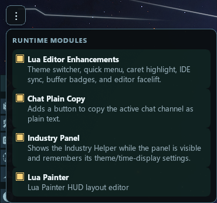

# du-tools

Mixed workspace for Dual Universe tooling: myDU server mods, live MCP-assisted coding workflows, in-game Lua authoring and code generation, and local browser-based RenderScript development.

Some folders target the [myDU](https://github.com/dual-universe/mydu-server-mods) local server installation directly. Others are fully local tools, browser apps, operator manuals, or tracked live-work artifacts.

It is highly recommended to use this repo in combination with an AI assistant to either help explain tools or install anything.
Most sub-folders have their own respective README.md for further details.
Some utility scripts may need paths adapted to either your own myDuServer installation.

## License

This repository is licensed under the GNU General Public License v3.0.
See [LICENSE](LICENSE) for the full text.

## Projects

### Live automation and in-game authoring

| Tool | Description |
| ---- | ----------- |
| [DuMcpBridge](DuMcpBridge/) | Local MCP server that turns the existing ModUiToolbox + Lua probe pipeline into a transport layer for live Dual Universe automation. Exposes tools for reading and writing open Lua or screen editors, chat interaction, native editor open steps, and related live UI actions. |
| [live_lua_coding](live_lua_coding/) | Operator manual and tracked artifact area for live bridge-driven Lua work. Contains the shared safety rules, editor targeting workflow, and tracked live snapshots for bridge-driven authoring. |
| [LuaPainter](LuaPainter/) | In-game layout painter for Dual Universe. Provides a visual editor for painting screen layouts, saving them on a programming board, and exporting generated Lua / RenderScript-style code for linked screens and signs. |

Note: parts of this live workflow can rely on separately installed helper tools such as `ScreenShotNet` and `AutoHotkey v2`.

It also covers the in-game Lua and screen editor enhancement layer delivered through `ModUiToolbox`: themed editor chrome for both editors, a 35-theme catalog, caret and viewport persistence, line highlighting, IDE sync, and the runtime-module/plugin system that makes it practical to add new in-game modules, including AI-assisted ones, without hard-wiring every feature into the probe core.

### Server mods (DLL)

| Tool | Description |
| ---- | ----------- |
| [ModFlightLogger](ModFlightLogger/) | Embedded server mod that records construct telemetry from Lua into NDJSON files. Computes derived metrics (acceleration, g-load, jerk, vertical speed, brake force estimates) and sends periodic chat summaries. Triggered via `system.modAction` from in-game Lua scripts. |
| [ModUiToolbox](ModUiToolbox/) | Embedded server mod that injects JavaScript payloads into the DU client UI. Captures full HTML, CSS, and JS dumps from the running game client via chunked NDJSON. Includes a Lua editor probe with per-filter position restore, IDE sync, and a local editor rig for development without a running game client. |

   
   
  Lua editor theming (35 light and dark themes):
   
  
   
  
   
  Industry UI theming:
   
  
   

---

### Data export

| Tool | Description |
| ---- | ----------- |
| [ItemExport2Json](ItemExport2Json/) | CLI tool that connects to the myDU Orleans backend and exports the full ItemBank to YAML and JSON files. Requires a running myDU stack with Orleans and Queueing services. |
| [ItemExportWin](ItemExportWin/) | Windows Forms GUI for exporting items and recipes from the myDU backend. Supports filtering by size, tier, nanocraftable status, and recipe time. Includes item/recipe lookup by name or ID. |
| [MeshDump](MeshDump/) | Scans the game client's `resources_generated/elements` directory and extracts axis-aligned bounding boxes from Unigine `.mesh` files. Outputs a JSON mapping of element names to their min/max coordinates. |

### Analysis

| Tool | Description |
| ---- | ----------- |
| [HashCheck](HashCheck/) | Computes deterministic 32-bit hash IDs from item names using a modified golden-ratio mixer and cross-references them against a set of known target IDs. Used to resolve item name-to-ID mappings. |
| [du_blueprint_parser.py](du_blueprint_parser.py) | Python script that parses Dual Universe blueprint JSON exports. Decodes and decompresses voxel data chunks (LZ4, zlib, or uncompressed), parses `VoxelCellData` binary structures, and prints per-material block counts and liter volumes. |

### RenderScript and screen tooling

| Tool | Description |
| ---- | ----------- |
| [rs_emulator](rs_emulator/) | **RScript Emulator**: full browser-based RenderScript playground for Dual Universe screen code. Runs Lua in a local canvas preview, supports persistent sessions, file import/export, module search paths, and Monaco-based editing. |
| [rs_tests](rs_tests/) | Lightweight Node-based regression tests around RenderScript-adjacent screen layout and Lua serialization behavior. Useful for small targeted checks without opening the browser app. |

### Server operations

| Tool | Description |
| ---- | ----------- |
| [logmgr](logmgr/) | Terminal UI (Rust/Ratatui) for browsing and tailing myDU server log files. Discovers log sources across Orleans, stack services, Kafka, Nginx, MongoDB, PostgreSQL, RabbitMQ, and Redis. Supports live multi-file follow mode with rotation detection. |

## Docs and data

| File | Description |
| ---- | ----------- |
| [all-mesh-boxes.json](all-mesh-boxes.json) | Bounding box data for all game element meshes, generated by MeshDump. |
| [du-tests.md](du-tests.md) | Authoritative live-test and truth-model guide for DuMcpBridge + ModUiToolbox work. Covers sequencing rules, board-runtime validation, visual-vs-chat precedence, and common live-debugging traps. |
| [du-visual-subagent.md](du-visual-subagent.md) | Probe-first dev-process note for using a screenshot-capable helper subagent during live Dual Universe work. Describes when to capture the `Dual Universe` window, when not to, and how to handle `Escape`/retry fallbacks. |

## Mod Requirements

Tools are written in C# (.NET 6 / .NET 8), Python 3, and Rust. Server mods target `net6.0` for compatibility with the myDU runtime. Standalone tools target `net8.0`.

Most C# tools reference DLLs from the myDU server install at `D:\MyDUserver\wincs\all` (configurable via `DUExternalLibDir` build property). See each tool's README for specific build and run instructions.

For the main live-work mod, `ModUiToolbox`, the compiled `ModUIToolbox.dll` must be copied into `MyDUserver\wincs\all\Mods` on whatever drive your myDU server is installed. That deployment is required for the Lua editor enhancements, Lua Painter runtime plugin, and in-game probing/bridge workflow in general.

Mandatory for `ModUiToolbox`: always build with `Release`. `Debug` builds are not a supported workflow for deployment, live testing, or handoff.

## Live DU Workflow Note

For live Dual Universe work, the repository can also use an optional external Windows screenshot MCP server alongside `DuMcpBridge`.

- Optional installation source: `https://github.com/tobitege/screenshotnet`
